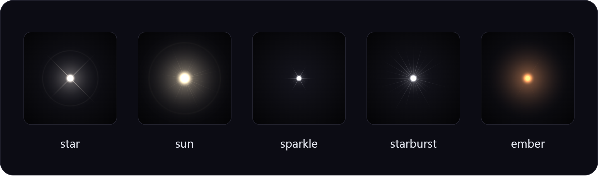

# shardlight

[](https://github.com/jukrapopk/shardlight/actions/workflows/ci.yml)
[](https://www.npmjs.com/package/shardlight)
[](./LICENSE)
[](https://jukrapopk.github.io/shardlight/)

Layered **shard** lens-flare lights for normal 2D React (DOM), [three.js](https://threejs.org)
and [React Three Fiber](https://docs.pmnd.rs/react-three-fiber) — one config that renders the same
in all three.



<p align="center">
  <a href="https://jukrapopk.github.io/shardlight/"></a>
  &nbsp;&nbsp;&nbsp;&nbsp;
  <a href="packages/shardlight/README.md"></a>
</p>

## Install

```bash
npm install shardlight
```

```tsx
import { ShardLight } from 'shardlight/react';

<ShardLight preset="star" size={320} />
```

Works the same in three.js and R3F, with per-shard motion, effects and imperative control — see the
[package README](packages/shardlight/README.md) for everything.

## Highlights

- **One light, three targets.** The same config renders to ``, to three.js planes and to R3F
  meshes, and looks identical everywhere.
- **Easy by default.** `<ShardLight preset="star" />` draws a light; swap the preset, or start from
  nothing.
- **Tunable at every level.** Preset → shards → per-shard motion → channel effects → per-frame
  values → CSS variables.
- **Declarative or imperative.** Describe lights as JSX / JSON, or drive them per frame from state,
  a ref, or CSS — without re-baking.
- **Extensible without forking.** New shard kinds, effects and presets plug in through public
  registries.
- **Data first.** Every light is a plain, versioned JSON config; JSX compiles to it.

## Monorepo

```
shardlight/
├── packages/shardlight/   # the published package (core + react + three + r3f + testing)
└── apps/demo/             # landing page + live demo (GitHub Pages)
```

## Development

```bash
pnpm install
pnpm build        # build packages/shardlight
pnpm test         # unit tests (Vitest)
pnpm test:visual  # Playwright golden + cross-target parity tests (Chromium)
pnpm demo         # start the demo site (localhost:5173)
pnpm lint
pnpm typecheck
pnpm format:check
```

The first visual run needs a browser: `pnpm --filter shardlight exec playwright install chromium`.

See [CONTRIBUTING.md](CONTRIBUTING.md).

## Publishing

```bash
pnpm build
cd packages/shardlight
npm pack --dry-run   # inspect what ships
npm publish          # requires `npm login` and access to the `shardlight` name
```

Or, with changesets:

```bash
pnpm changeset
pnpm version-packages
pnpm release
```

## License

MIT
